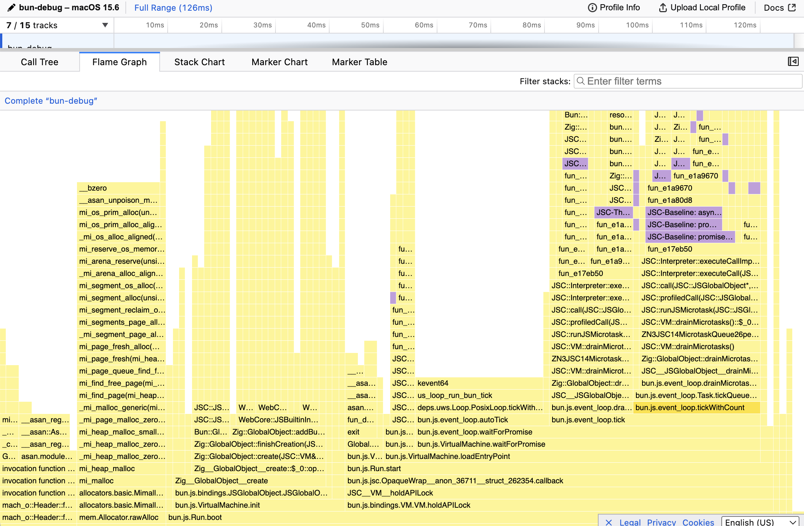

# hono-bun-samply

Example of running Hono on Bun and profiling with samply

## Requirements

- [Bun](https://bun.com)
- [samply](https://github.com/mstange/samply)
- [bombardier](https://github.com/codesenberg/bombardier)

## Setup

```
bun install
```

## Run

The following script starts hono-server.js with Bun while recording with samply, and sends requests using bombardier.

```
bun run bench
```

After sufficient requests have been sent, samply will generate `hono-profile.json`.

```
samply load ./hono-profile.json
```

## Screenshot



